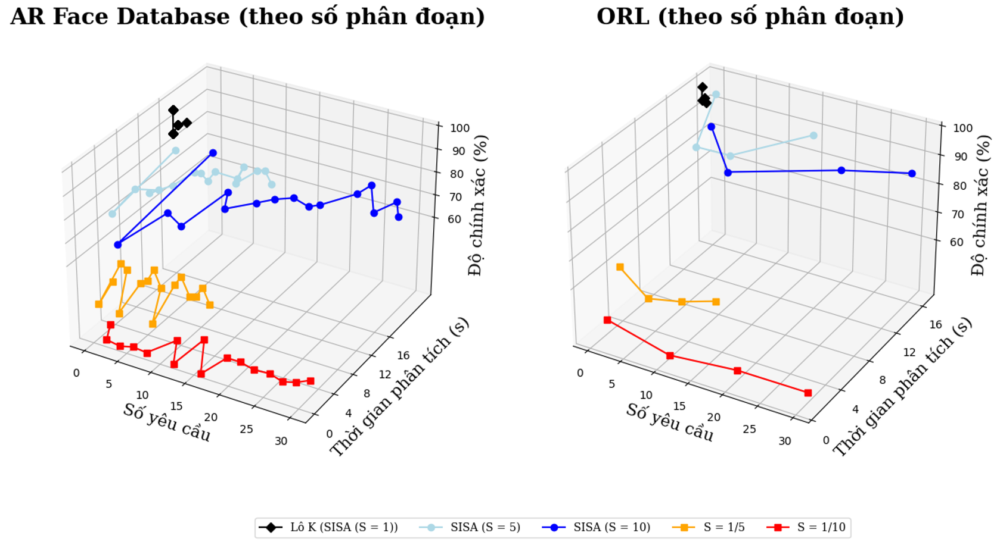
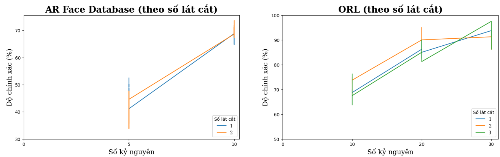

# Nâng cao hiệu quả các mô hình nhận dạng khuôn mặt dùng SISA

## Thông tin đề tài

- Tên đề tài: Nâng cao hiệu quả các mô hình nhận dạng khuôn mặt dùng SISA
- Loại đề tài: Khóa luận tốt nghiệp
- GVHD: PGS. TS. Lê Hoàng Thái
- Sinh viên thực hiện:

| Họ và tên  | MSSV  | Chuyên ngành  |
|    ---     | ---   | ---   |
| Bùi Tiến Đạt  | 20127130  | Khoa học máy tính  |
| Đặng Minh Đức  | 20127136  | Khoa học máy tính  |

## Cách chạy code trong đề tài

- Trước hết, chúng tôi sẽ chạy code trên file `face_data/orl/prepare_orl.py` hoặc `face_data/ar/prepare_ar.py` nhằm xuất ra dữ liệu sau khi chia thành tỉ lệ tùy thuộc vào tập dữ liệu (ORL: 80% train và 20% test, AR: 80% train và 20% test) phục vụ cho `dataloader.py`.
- Tiếp đến, chúng tôi tiến hành thực nghiệm trên đề tài này theo từng bước sau:
    * Khởi tạo 1 "container" với `S` phân đoạn cụ thể: `bash orl_init.sh S` hoặc `bash ar_init.sh S`
    * Huấn luyện phương pháp SISA với `S` phân đoạn, `R` lát cắt và `e` kỷ nguyên cụ thể trong "container": `bash orl_train.sh S R e` hoặc `bash ar_train.sh S R e`
    * Kiểm thử `S` shard cụ thể: `bash orl_predict.sh S` hoặc `bash ar_predict.sh S`
    * Tổng hợp các tham số đầu ra của từng phân đoạn và xuất ra kết quả trong file CSV: `bash orl_data.sh S R e` hoặc `bash ar_data.sh S R e` với `S` là số phân đoạn, `R` là số lát cắt và `e` là số kỷ nguyên. Nếu muốn đưa ra kết quả trong trường hợp `baseline` (tức là một phần của phân đoạn), chúng tôi sẽ chạy các file `bash orl_data_baseline.sh S R e` hoặc `bash ar_data_baseline.sh S R e`. Đối với bước này, chúng tôi muốn đưa ra thông tin về `S`, `R`, `e` nhằm phục vụ cho việc trực quan hóa dữ liệu nói riêng và báo cáo khóa luận nói chung. 

## Kết quả thực nghiệm

### 1. Kết quả thực nghiệm dựa trên số phân đoạn
#### a. Thời gian huấn luyện và độ chính xác

#### b. Số lượng ảnh khuôn mặt được huấn luyện lại

### 2. Kết quả thực nghiệm dựa trên số lát cắt

### 3. Tốc độ huấn luyện
#### 3.1. Tập dữ liệu AR Face Database

| Trường hợp  | Thời gian huấn luyện  | Tốc độ huấn luyện  |
|    ---     | ---   | ---   |
| Huấn luyện lại từ đầu (s = 1, r = 1)  | 238.89  | 1  |
| s = 5, r = 1  | 188.06  | 1.27  |

với s là số phân đoạn và r là số lát cắt
#### 3.2. Tập dữ liệu ORL

| Trường hợp  | Thời gian huấn luyện  | Tốc độ huấn luyện  |
|    ---     | ---   | ---   |
| Huấn luyện lại từ đầu (s = 1, r = 1)  | 54.9  | 1  |
| s = 5, r = 1  | 52.42  | 1.05  |
| s = 10, r = 1  | 56.89  | 0.97  |

với s là số phân đoạn và r là số lát cắt

## Nguồn tham khảo
- Các bài báo tham khảo được trình bày trong báo cáo
- Code tham khảo: https://github.com/cleverhans-lab/machine-unlearning